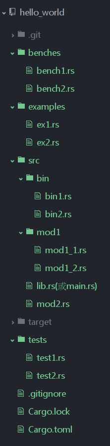

#cargoIntroduction

Once upon a time, for apes who are accustomed to using `C/C++` language, the organization and management of project code is definitely a nightmare. In order to solve the management problem of `C/C++` projects, the ape gods have tried various methods and developed various project management tools, from `automake` at the beginning to `cmake` and `qmake` later Wait, but the result is not satisfactory. It often solves some problems, but introduces more problems. `C/C++` apes often fall into the trap of mastering the language itself and complex syntax of construction tools. Dilemma. Coincidentally, the project code organization and management tools `ant` and `maven` of `java` also have the same problem. Complex project management configuration parameters often overwhelm the apes.

As a modern language, `rust` naturally abandons the methods and means of project code management in the stone age. The `rust` project team provides a super killer `cargo` for everyone to solve the interference and confusion caused by project code management. Apes who have used `node.js` should be impressed by the artifacts `npm`, `grunt`, `gulp` and other tools in `node.js`. As the leader of the new generation of static languages, `rust` officially refers to the advantages of existing language management tools, so `cargo` was created.

All in all, as the code organization and management tool of `rust`, `cargo` provides a series of tools, from project establishment, construction to testing, operation and deployment, providing as complete means as possible for the management of `rust` projects . At the same time, it is closely integrated with the various features of the `rust` language and its compiler `rustc` itself. It can be said that it is not only the intimate lover of the language itself, but also the intimate little padded jacket of the `rust` apes. Whoever uses it will know.
Not much nonsense, just go straight to the examples and various high-definition horseless pictures.

# Getting started with cargo
First of all, of course, it’s still nonsense. To use cargo, you must first install cargo. There are three ways to install cargo. For the first two methods, please refer to the installation method of rust, because the cargo tool is of official orthodox origin and is of course included in the official distribution package. The third method is to build from the source code repository of the [`cargo`](https://github.com/rust-lang/cargo) project. Oh, My God. It is indeed nonsense.

Well, assuming that you have installed cargo, let's learn the starting gesture with me. Of course, in the world of apes, the opening gestures are generally the same - that is the `hello world` method.
Type in terminal

```bash
$ cargo new hello_world --bin
```

The above command uses **cargo new** to create a new rust project based on cargo project management in the current directory. The project name is hello_world, and --bin means that the project will generate an executable file. The specific generated project directory structure is as follows:

```bash
$ cd hello_world
$ tree .
.
├── Cargo.toml
└── src
    └── main.rs

1 directory, 2 files
```

You can enter the above command in the terminal and press the Enter key to see the above results, or you can directly go to the editor or file manager to observe.
Open the main.rs file, and you can see that the cargo new command automatically generates all the code necessary for hello_world to run:

```rust
fn main() {
    println!("Hello, world!");
}
```

Well, impatient apes may be impatient to take off their pants, well, let's build and see how amazing cargo is, enter in the terminal:

```bash
$ cargo build
```

Wait for a while, and cargo will automatically build everything needed for us to build a high-definition application. For this starting move, the buffer will not exceed 5 seconds, and the player with 12 seconds 88 will hold back.

```bash
$ cargo run
    Running `target/debug/hello_world`
Hello, world!

```

What did I see, what did I see, did I get scared, did I get scared. Well, cargo is that simple.

Of course, the beauty of cargo is not just simple. Although cargo is simple, it is very powerful. How powerful is it? ? It can be said that, basically, the means needed for rust development and management are available in cargo. Small but powerful, strong and moral, without a horse, the learning curve is almost zero.

# Organizational structure of rust project based on cargo
Let’s not talk nonsense this time, first upload the high-definition horseless picture:



The default project structure of the above cargo is explained as follows:

##### `cargo.toml` and `cargo.lock` files are always located in the project root directory.
##### The source code is located in the `src` directory.
##### The default library entry file is `src/lib.rs`.
##### The default executable program entry file is `src/main.rs`.
##### Other optional executable files are located in `src/bin/*.rs` (here each rs file corresponds to an executable file).
##### The external test source code files are located in the `tests` directory.
##### Example program source code files are located in `examples`.
##### Benchmark source code files are located in the `benches` directory.

Well, everyone must keep these default rules in mind, and it is best to organize your rust projects according to this model.

# cargo.toml and cargo.lock
`cargo.toml` and `cargo.lock` are the two core files of the cargo project code management, and all activities of the cargo tool are based on these two files.

`cargo.toml` is a cargo-specific project data description file. For the apes, the `cargo.toml` file stores all the information of the project. It is directly oriented to the rust apes. If the apes want their rust projects to follow the To build, test and run in the expected way, then 'cargo.toml' must be built in a reasonable way.

The `cargo.lock` file is not directly oriented to apes, and apes do not need to modify this file directly. The lock file is a project dependency detailed list file generated by the cargo tool based on the toml file of the same project, so we generally don't need to ignore it, just need to look at the `cargo.toml` file.

```toml
[package]
name = "hello_world"
version = "0.1.0"
authors = ["fuying"]

[dependencies]
```

The toml file is composed of paragraphs such as [package] or [dependencies], and each paragraph is composed of multiple fields. These paragraphs and fields describe the basic information of the project organization, such as the [package] paragraph in the above toml file Describes some information about the `hello_world` project itself, including the project name (corresponding to the name field), project version (corresponding to the version field), author list (corresponding to the authors field), etc.; the [dependencies] paragraph describes the `hello_world` project What are the dependent projects.

Let's take a look at the meaning of commonly used paragraphs and fields in the toml description file.

# package paragraph
The [package] paragraph describes the various metadata description information of the project by the software developer. For example, the [name] field defines the name of the project, the [version] field defines the current version of the project, and [authors] defines all of the project. Author, of course, the [package] section not only contains these fields, other optional fields in the [package] section are detailed in the cargo parameter configuration section.

# Define project dependencies
The biggest advantage of using the cargo tool is that it can manage various dependencies of the project conveniently, uniformly and flexibly. This is also one of the important goals of using cargo to manage rust projects. In cargo's toml file description, various dependencies of the project are mainly described through various dependency paragraphs. Commonly used dependency paragraphs in toml include the following:
- Based on crates.io, the official rust warehouse, described by release notes:
- Based on the git warehouse address of the project source code, described by URL:
- Based on the absolute path or relative path of the local project, described by the path in Unix-like mode:
These three forms are specifically written as follows:

```toml
[dependencies]
typemap = "0.3"
plugin = "0.2*"
hammer = {version = "0.5.0"}
color = { git = "https://github.com/bjz/color-rs" }
geometry = { path = "crates/geometry" }
```

In the above example, 2-4 behaviors are written in method 1, 5th behavior is written in method 2, and 6th behavior is written in method 3.
These three writing methods have their own advantages. If the project needs to use crates.io official warehouse to manage project dependencies, the first method is recommended. If the project developer prefers to use the latest source code in the git repository, method 2 can be used. Method 2 is also often used as an alternative when the dependencies of the official repository fail to compile. Method three is mainly used for dependencies whose source code is located locally.

# Define integration test cases

Another important function of cargo is to integrate the necessary and very important testing links in the software development process, and manage the tests through code attribute declarations or toml file descriptions. Among them, the unit test is mainly described by the `#[test]` attribute before the test code part of the project code, and the integration test is generally described by the [[test]] paragraph in the toml file.
For example, assuming that the integration test files are located in the tests folder, toml can be written like this:

```toml
[[test]]
name = "testinit"
path = "tests/testinit.rs"

[[test]]
name = "testtime"
path = "tests/testtime.rs"
```

In the above example, the name field defines the name of the integration test, and the path field defines the path of the integration test file relative to this toml file.
See how easy it is to define integration tests.
have to be aware of is:

- If no integration test entry is defined in Cargo.toml, each rs file in the tests directory (not including subdirectories) is regarded as an integration test entry.
- If the integration test entry is defined in Cargo.toml, then the defined rs are the entry, and no integration test entry is specified by default.

# Define project examples and executable programs
** Above we introduced three commonly used functions in cargo project management, and there are two frequently used functions: description of example use case and description of bin use case. Its description method is similar to the test case description method. However, this time the section name '[[test]]' is replaced by: '[[example]]' or '[[bin]]' respectively. For example:**

```toml
[[example]]
name = "timeout"
path = "examples/timeout.rs"

[[bin]]
name = "bin1"
path = "bin/bin1.rs"

```

The examples and bins declared in the '[[example]]' and '[[bin]]' paragraphs need to be run via 'cargo run --example NAME' or 'cargo run --bin NAME', where NAME corresponds to The name you define in the name field.

# Build, clean, update and install
It is an important aspect to understand the writing method of the toml description file. Another important aspect is the various useful tools that the cargo tool itself provides for our programmers. If you are interested, you can enter 'cargo --help' in the terminal to view it. The most commonly used command during development is 'cargo build', which is used to build the project. In addition, the 'cargo clean' command can clean up all the content in the target folder; 'cargo update' re-retrieve and update the information of various dependencies according to the toml description file, and write the lock file, such as the update and change of the dependency version, etc. etc; 'cargo install' can be used for actual production deployments. These commands are very useful in actual development and deployment.

**For more detailed usage of cargo, please refer to ['28. Cargo parameter configuration'](../cargo-detailed-cfg/cargo-detailed-cfg.md)**
