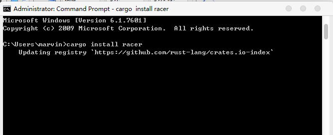
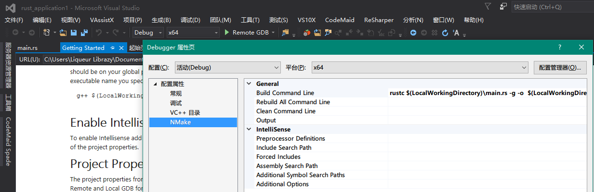
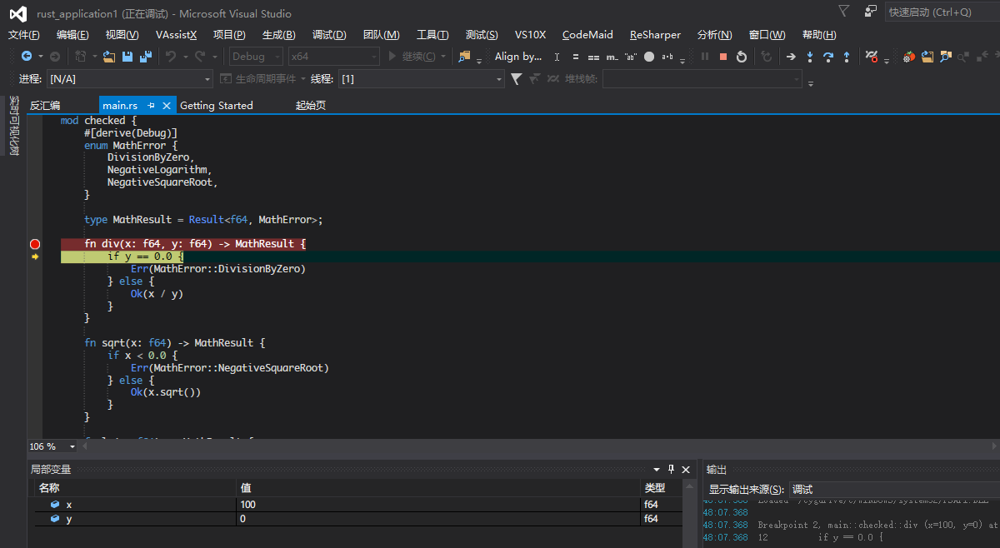
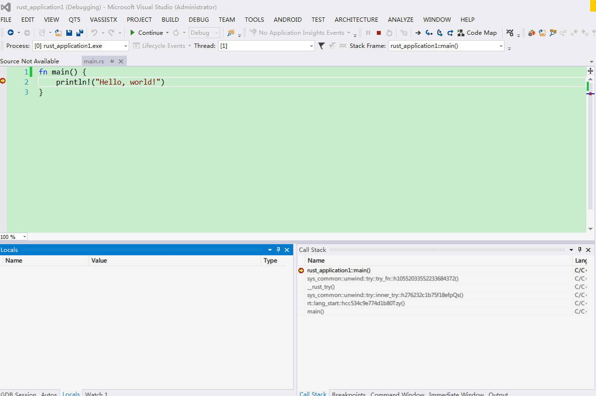

# Visual Studio

This article is done using VisualRust and VS GDB Debugger / VisualGDB to edit and debug Rust programs in VisualStudio.

## Install Rust, Cargo

First you need to download Rust, download address https://www.rust-lang.org/downloads.html

Here we must download the version of Windows GNU ABI, because we need to use GDB to debug.

In addition, Visual Studio 2013 or 2015 also needs to be installed on the machine.
After installing Rust, open the command line and execute
cargo install racer

Racer is used for Rust auto-completion and will be used in VisualRust. Here we use the racer compiled by rust, not the racer that comes with VisualRust, because it is too old.
In addition, you need to download the Rust source code, set
RUST_SRC_PATH is the directory of Rust source code src

## Install VisualRust and VS GDB Debugger

After finishing the above work, you can install VisualRust and VS GDB Debugger, download here
https://github.com/PistonDevelopers/VisualRust
https://visualstudiogallery.msdn.microsoft.com/35dbae07-8c1a-4f9d-94b7-bac16cad9c01

VisualGDB is available for purchase here
http://www.visualgdb.com/

## Compile the Rust project

Create a new Rust project

Set racer and rust_src_path in tool, option

At this time, you can automatically prompt when writing code. like below

## Debug Rust project with VS GDB Debugger

Ok, let's start your Rust journey happily. Let's start debugging Rust with VS GDB Debugger.

In the solution, add the GDB debug project

Set the directory and file name of the program to be debugged

Set the compilation command of the program that needs to be debugged, use rustc here, or use cargo to compile

Add the source code of the program to be debugged to the project directory

Open the source code file and set breakpoint information, set the project as the startup project and select Local GDB to start debugging

## Debugging Rust projects with VisualGDB

After building the Rust program, click debug, select quick debug with gdb

Then select the path of MingW and exe in it

  Click Debug to start your debugging life

