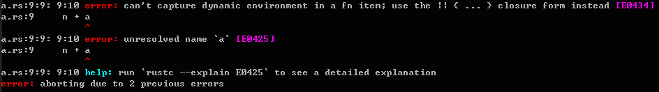

# Higher order functions
   A higher-order function differs from a normal function in that it can take one or more functions as parameters and return functions as values. Rust's function is a first class type, so it supports higher-order functions. However, since rust is a strongly typed language, if you want to use functions as parameters or return values, you first need to understand the type of the function. Let's talk about the type of function first, and then talk about functions as parameters and return values.

## function type
   As mentioned earlier, the keyword `fn` can be used to define functions. Among other things, it is used to construct function types. The main difference from a function definition is that a constructor type does not require a function name, parameter names, and function body. It is described in the Rust Reference as follows:
  > The function type constructor fn forms new function types. A function type consists of a possibly-empty set of function-type modifiers (such as unsafe or extern), a sequence of input types and an output type.

   Let's look at a simple example:
  
  ```rust
fn inc(n: i32) -> i32 {//function definition
  n + 1
}

type IncType = fn(i32) -> i32;//function type

fn main() {
  let func: IncType = inc;
  println!("3 + 1 = {}", func(3));
}
  ```
  
   The above example first uses `fn` to define the `inc` function, which has an `i32` type parameter and returns a value of `i32` type. Then use `fn` to define a function type, this function type has i32 type parameters and i32 type return value, and use `type` keyword to define its alias `IncType`. A variable `func` is defined in the `main` function, its type is `IncType`, and the value is assigned to `inc`, and then called in the `pirntln` macro: `func(3)`. As you can see, the type of `inc` function is actually `IncType`.
   There is a problem here. We assigned `inc` to `func` instead of `&inc`. Does this mean that the ownership of the `inc` function is transferred to `func`? After the assignment, you can use `inc() ` form calls the `inc` function? Let's look at an example first:
  
  ```rust
fn main() {
  let func: IncType = inc;
  println!("3 + 1 = {}", func(3));
  println!("3 + 1 = {}", inc(3));
}

type IncType = fn(i32) -> i32;

fn inc(n: i32) -> i32 {
  n + 1
}
  ```
  
   We saved the above example in the rs source file, and then compiled it with rustc, and found that no error was reported, and we also got the desired result after running:
  
  ```
3 + 1 = 4
3 + 1 = 4
  ```
  
   This shows that when assigning, the ownership of the `inc` function is not transferred to the `func` variable, but more like an immutable reference. In rust, the ownership of a function cannot be transferred. When we assign a value to a variable of a function type, we usually assign a function pointer, so the function type in rust is like a function pointer in C/C++. Of course, Rust's function types are safer. It can be seen that the function type of rust should actually belong to the pointer type (Pointer Type). Rust's Pointer Type has two types, one is a reference (Reference`&`), and the other is a raw pointer (Raw pointer `*`). For details, please refer to [Rust Reference 8.18 Pointer Types](http://doc .rust-lang.org/reference.html#pointer-types). The function type of rust should be a reference type, because it is safe, but the raw pointer is not safe. To use the raw pointer, you must use the `unsafe` keyword declaration.

## function as parameter
   Functions are used as parameters, and their declarations are the same as ordinary parameters. See the following example:
  
  ```rust
fn main() {
  println!("3 + 1 = {}", process(3, inc));
  println!("3 - 1 = {}", process(3, dec));
}

fn inc(n: i32) -> i32 {
  n + 1
}

fn dec(n: i32) -> i32 {
  n - 1
}

fn process(n: i32, func: fn(i32) -> i32) -> i32 {
  func(n)
}
  ```
  
   In the example, `process` is a higher-order function, which has two parameters, `n` of type `i32`, and a function `func` of type `fn(i32)->i32`, which returns a A parameter of type `i32`; it calls the `func` function with `n` as a parameter in the function body, and returns the return value of the `func` function. Running can get the following results:
  
  ```
3 + 1 = 4
3 - 1 = 2
  ```
  
   However, this is not the only way to declare functions as parameters. It is also possible to use generic functions with traits (`trait`), because rust functions will implement a `trait`: `FnOnce`, `Fn` or `FnMut`. Replacing the `process` function definition in the above example with the following form is equivalent:
  
  ```rust
fn process<F>(n: i32, func: F) -> i32
    where F: Fn(i32) -> i32 {
    func(n)
}
  ```

## function as return value
   The function is used as the return value, and its declaration is the same as the return value type declaration of a normal function. See example:
  
  ```rust
fn main() {
   let a = [1,2,3,4,5,6,7];
   let mut b = Vec::<i32>::new();
   for i in &a {
       b.push(get_func(*i)(*i));
   }
   println!("{:?}", b);
}

fn get_func(n: i32) -> fn(i32) -> i32 {
    fn inc(n: i32) -> i32 {
        n + 1
    }
    fn dec(n: i32) -> i32 {
        n - 1
    }
    if n % 2 == 0 {
        inc
    } else {
        dec
    }
}
   ```
  
   The high-order function in the example is `get_func`, which receives a parameter of type i32 and returns a function of type `fn(i32) -> i32`, if the parameter passed in is an even number, returns `inc`, otherwise returns `dec`. It should be noted here that both `inc` function and `dec` function are defined in `get_func`. Defining functions within functions is not supported in many other languages, but rust supports it, which is also a manifestation of rust's flexibility and power. However, the function defined in the function cannot contain variables in the function (in the environment). If it is to be included, it should be closed (see Chapter 13 Closures for details).
   So the following example:
  
  ```rust
fn main() {
  let f = get_func();
  println!("{}", f(3));
}

fn get_func() -> fn(i32)->i32 {
  let a = 1;
  fn inc(n:i32) -> i32 {
    n + a
  }
  inc
}
  ```
  
   When compiling with rustc, the following error occurs:
  
