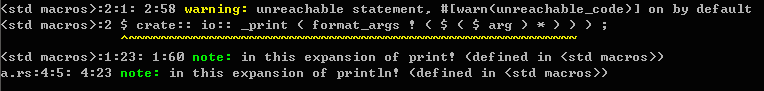

# function return value
   In rust, any function has a return type, and when the function returns, it returns a value of that type. Let's take a look at the main function first:
  
  ```rust
  fn main() {
    //statements
  }
  ```
  
   As I said before, the return value type of a function is specified by adding an arrow and a type after the parameter list. However, the definition of the main function we generally see does not do this. This is because the return value of the main function is `()`, in rust, when a function returns `()`, it can be omitted. The full form of the main function is as follows:
  
  ```rust
  fn main() -> () {
    //statements
  }
  ```
  
   The return value type of the main function is `()`, which is a special tuple - a tuple with no elements, called `unit`, which means that a function has no information to return. The description in [Types](https://doc.rust-lang.org/reference/types.html#tuple-types) of the Rust Reference is as follows:
   > For historical reasons and convenience, the tuple type with no elements (`()`) is often called ‘unit’ or ‘the unit type’.

   The `()` type is actually similar to the `void` type in C/C++, Java, and C#.

   Let's look at an example with a return value:
  
  ```rust
  fn main() {
    let a = 3;
    println!("{}", inc(a));
  }

  fn inc(n: i32) -> i32 {
    n + 1
  }
  ```
  
   In the above example, the function `inc` has a parameter of type `i32` and a return value, the function is to add 1 to the parameter and return it. It should be noted that there is only one expression of `n+1` in the `inc` function, and there is no explicit `return` statement like C/C++ or Java, C# and other languages to return a value. This is because, unlike other statement-based languages (such as C), rust is an expression-based language, and the value of the last expression in a function defaults to the return value. Of course, there are also statements in rust. For statements and expressions in rust, please see [next section](statement_expression.md).

## return keyword
   Rust also has the `return` keyword, but it is generally used to return early. Let's look at a simple example:
  
  ```rust
fn main() {
  let a = [1,3,2,5,9,8];
  println!("There is 7 in the array: {}", find(7, &a));
  println!("There is 8 in the array: {}", find(8, &a));
}

fn find(n: i32, a: &[i32]) -> bool {
  for i in a {
    if *i == n {
      return true;
    }
  }
  false
}
  ```
  
   In the above example, the `find` function accepts an `i32` type `n` and a `i32` type slice (`slice`) `a`, and returns a `bool` value. If n is an element of a, then Return `true`, otherwise return `false`. It can be seen that the `return` keyword is used in the `if` expression of the `for` loop. If the element of a is equal to n at this time, it will return true immediately, and the rest of the loop does not need to be performed, otherwise it will continue to loop Check the entire slice (slice), and finally return false. Of course, the return statement can also be used at the end to return, like C/C++: it is also possible to change the last sentence `false` of the `find` function to `return false;` (note that the semicolon cannot be omitted), but this is not the case. rust programming style. It should be noted here that the type of `i` in the `for` loop is `&i32`, and it needs to use the dereference operator to convert it to the `i32` type. In addition, slice (slice) can be regarded as a reference to an array here. For a detailed explanation of slices and arrays, see [Rust Reference](https://doc.rust-lang.org/reference.html#array-and -slice-types) and related stuff in [rustbyexample](http://rustbyexample.com/primitives/array.html).

## return multiple values
   Rust's function does not support multiple return values, but we can use tuples to return multiple values, which is very flexible to use with rust's pattern matching. Look at the example first:
  
  ```rust
fn main() {
  let (p2,p3) = pow_2_3(789);
  println!("pow 2 of 789 is {}.", p2);
  println!("pow 3 of 789 is {}.", p3);
}

fn pow_2_3(n: i32) -> (i32, i32) {
  (n*n, n*n*n)
}
  ```
  
   It can be seen that in the above example, the `pow_2_3` function receives a value of type `i32` and returns its quadratic and cubic values, which are wrapped in a tuple and returned. In the `main` function, the `let` statement can use pattern matching to deconstruct the tuple returned by the function, and assign these two return values to `p2` and `p3` respectively, so that `789` can be obtained twice square and cubic values.

## divergence function
   Diverging functions are a feature in rust. The divergent function does not return, it uses the exclamation point `!` as the return type to indicate:
  
  ```rust
fn main() {
  println!("hello");
  diverging();
  println!("world");
}

fn diverging() -> ! {
  panic!("This function will never return");
}
  ```
  
   Since the diverging function will not return, even if there are other statements afterwards, it will not be executed. If there are other statements after it, the following compilation warning will appear: . Of course, what we need to know is that non-divergent functions can also not return, such as infinite loops and the like.
   Divergent functions generally end with `panic!` macro calls or other calls to other divergent functions, so calling a divergent function will cause the current thread to crash. The description in [Rust Reference 6.1.3.2 Diverging functions][ref] reads:
  > We call such functions "diverging" because they never return a value to the caller. Every control path in a diverging function must end with a panic!() or a call to another diverging function on every control path. The ! denote a type.

  [ref]:http://doc.rust-lang.org/reference.html#diverging-functions
 
