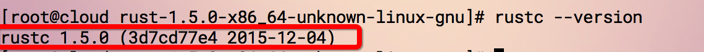

# Rust for Linux

Rust supports mainstream operating systems, Linux, Mac and windows.

Rust provides two installation methods for Linux users:

### 1. Download the installation package directly:

If you download the installation package directly, you need to check whether your current operating system is 64-bit or 32-bit, and download the corresponding installation package respectively.

To view the operating system, please execute the following command in the terminal:

`uname -a`

The result is shown in the figure below:

As shown in the figure above, if it is **x86_64**, it proves to be a 64-bit system, which requires [download](https://static.rust-lang.org/dist/rust-1.5.0-x86_64-unknown-linux- gnu.tar.gz) 64-bit installation package;

If it is **x86-32**, you need [download](https://static.rust-lang.org/dist/rust-1.5.0-i686-unknown-linux-gnu.tar.gz) 32-bit installation Bag

After downloading the installation package, unzip and run it. *At the time of writing this chapter, the latest stable version is 1.5.0,*
  Decompression: `tar -zxvf rust-1.5.0-x86_64-unknown-linux-gnu.tar.gz`

  Enter the corresponding directory after decompression: `cd rust-1.5.0-x86_64-unknown-linux-gnu`
  Execute `./install.sh`

After the above command is executed, it will print: **Rust is ready to roll.** indicating that the installation is successful

Execute at this time: `rustc --version`, you will see the corresponding rust version information, as shown in the following figure:

### 2. One-click installation from the command line:
Rust provides a simple one-click installation, the command is as follows:

`curl -sSf https://static.rust-lang.org/rustup.sh | sh`

Open the terminal and execute the above command.

**Notice**

In addition to the stable version, Rust also provides Beta and Nightly versions, the download addresses are as follows:
https://www.rust-lang.org/zh-CN/other-installers.html

If you don't want to install Rust on your computer, but you still want to try rust, there is an online environment here: http://play.rust-lang.org/

The mirror source of the University of Science and Technology of China includes [rust-static](http://mirrors.ustc.edu.cn/rust-static/), students who have temporary problems with the ladder can try to download the compiler from here; in addition. There is also Crates source, see [instructions here](https://servers.ustclug.org/2016/01/mirrors-add-rust-crates/) for details.
